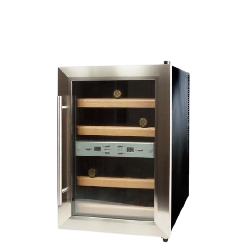

<!-- PROJECT LOGO  -->
 

  

  <h3 align="center">Whine inventory management</h3>

  

    Whine is een inventory management systeem te gebruiken op een Raspberryt Pi i.c.m een MCFR522 RFID lezer.
     
    <a href="https://github.com/ShoQue92/whine"><strong>Explore the docs »</strong></a>
     
     
    <a href="https://github.com/ShoQue92/whine">View Demo</a>
    ·
    <a href="https://github.com/ShoQue92/whine/issues">Report Bug</a>
    ·
    <a href="https://github.com/ShoQue92/whine/issues">Request Feature</a>
  

<!-- TABLE OF CONTENTS -->
## Table of Contents

* [About the Project](#about-the-project)
  * [Built With](#built-with)
* [Getting Started](#getting-started)
  * [Prerequisites](#prerequisites)
  * [Installation](#installation)
* [Contact](#contact)
* [Acknowledgements](#acknowledgements)

<!-- ABOUT THE PROJECT -->
## About The Project

### Built With

* [Python]()
* [PHP]()
* [JQuery]()
* [Raspberry Pi 3B]()
* [MFCR522 RFID]()
* [Whine Klima D12]()

<!-- GETTING STARTED -->
## Getting Started

### Prerequisites

### Installation

<!-- USAGE EXAMPLES -->
## Usage

<!-- CONTACT -->
## Contact

Joerie Brugts- joerie@brugts.nl
Project Link: [https://github.com/ShoQue92/whine](https://github.com/ShoQue92/whine)

<!-- ACKNOWLEDGEMENTS -->
## Acknowledgements

* 
* 
* 
